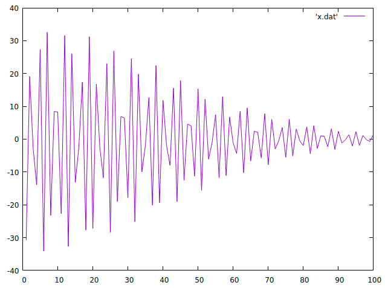

# Damped-Simple-Harmonic-Motion-Code
FORTRAN Code plotting the points of simple harmonic motion with Damping Included!

Please use linux as it is the best OS to compile and run FORTRAN. I have used gnuplot as my data plot analysis tool but you can try to use whatever other method you want.
